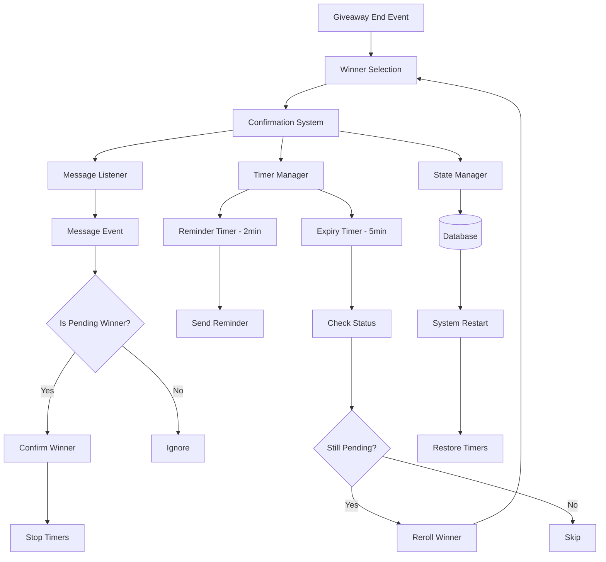

# Design Document: Giveaway Winner Confirmation

## Overview

The Giveaway Winner Confirmation system provides automatic winner validation with time-limited response requirements and automatic reroll functionality. The system monitors server messages to detect winner confirmations, manages multiple concurrent timers for reminders and expiry, and automatically selects new winners when original winners fail to respond.

The design emphasizes reliability through database persistence, accurate timer management with system restart recovery, and clear state transitions. The system integrates with Discord's message events and slash commands while maintaining independence from other bot features.

## Architecture

### High-Level Architecture



### Component Responsibilities

1. **Confirmation System**: Orchestrates the entire confirmation workflow
2. **Timer Manager**: Manages reminder and expiry timers with persistence
3. **Message Listener**: Monitors Discord message events for winner confirmations
4. **State Manager**: Manages winner state transitions and database persistence
5. **Reroll Handler**: Selects new winners and handles reroll logic
6. **Config Manager**: Manages giveaway command permissions

## Components and Interfaces

### 1. Confirmation System

**Purpose**: Central orchestrator for winner confirmation workflow

**Interface**:
```typescript
interface ConfirmationSystem {
  // Start confirmation process for winners
  startConfirmation(giveawayId: string, winners: User[]): Promise<void>;
  
  // Handle winner confirmation
  confirmWinner(giveawayId: string, userId: string): Promise<void>;
  
  // Handle manual reroll command
  manualReroll(giveawayId: string, userId: string, moderatorId: string): Promise<void>;
  
  // Restore active confirmations on startup
  restoreActiveConfirmations(): Promise<void>;
}
```

**Responsibilities**:
- Initialize confirmation process when giveaway ends
- Coordinate between Timer Manager, Message Listener, and State Manager
- Send announcement messages with winner mentions and instructions
- Handle winner confirmation events
- Process manual reroll commands
- Restore state on system restart

### 2. Timer Manager

**Purpose**: Manage reminder and expiry timers with persistence

**Interface**:
```typescript
interface TimerManager {
  // Start timers for a winner
  startTimers(giveawayId: string, userId: string, startTime: Date): void;
  
  // Stop all timers for a winner
  stopTimers(giveawayId: string, userId: string): void;
  
  // Restore timers from database on startup
  restoreTimers(activeWinners: WinnerRecord[]): void;
  
  // Check if timers exist for a winner
  hasActiveTimers(giveawayId: string, userId: string): boolean;
}

interface TimerCallbacks {
  onReminder: (giveawayId: string, userId: string) => Promise<void>;
  onExpiry: (giveawayId: string, userId: string) => Promise<void>;
}
```

**Responsibilities**:
- Schedule reminder callbacks at 2 minutes elapsed
- Schedule expiry callbacks at 5 minutes elapsed
- Cancel timers when winners confirm
- Persist timer state to database
- Restore timers on system restart with correct remaining time
- Handle edge cases (timer already expired during restart)

**Implementation Details**:
- Use `setTimeout` for timer scheduling
- Store timer references in a Map keyed by `${giveawayId}:${userId}`
- Calculate elapsed time on restart: `now - startTime`
- If elapsed >= 5 minutes on restart: trigger expiry immediately
- If elapsed >= 2 minutes but < 5 minutes on restart: skip reminder, schedule expiry
- If elapsed < 2 minutes on restart: schedule both reminder and expiry

### 3. Message Listener

**Purpose**: Monitor Discord message events for winner confirmations

**Interface**:
```typescript
interface MessageListener {
  // Initialize message event listener
  initialize(client: Discord.Client): void;
  
  // Check if user is a pending winner
  isPendingWinner(guildId: string, userId: string): Promise<boolean>;
  
  // Get all giveaways where user is a pending winner
  getPendingGiveaways(guildId: string, userId: string): Promise<string[]>;
}
```

**Responsibilities**:
- Listen to Discord `messageCreate` events
- Check if message author is a pending winner in any active giveaway
- Trigger confirmation process when pending winner sends message
- Ignore bot messages and messages from non-winners

**Implementation Details**:
- Register event handler on Discord client
- Query database for pending winners on each message
- Optimize with in-memory cache of pending winners (invalidate on state change)
- Handle messages in any channel (not restricted to giveaway channel)

### 4. State Manager

**Purpose**: Manage winner state transitions and database persistence

**Interface**:
```typescript
interface StateManager {
  // Create winner record
  createWinner(record: WinnerRecord): Promise<void>;
  
  // Update winner status
  updateStatus(giveawayId: string, userId: string, status: WinnerStatus): Promise<void>;
  
  // Get winner record
  getWinner(giveawayId: string, userId: string): Promise<WinnerRecord | null>;
  
  // Get all winners for a giveaway
  getWinners(giveawayId: string): Promise<WinnerRecord[]>;
  
  // Get all pending winners across all giveaways
  getAllPendingWinners(): Promise<WinnerRecord[]>;
  
  // Check if user has any winner state for giveaway
  hasWinnerState(giveawayId: string, userId: string): Promise<boolean>;
}

enum WinnerStatus {
  PENDING = 'PENDING',
  CONFIRMED = 'CONFIRMED',
  REROLLED = 'REROLLED'
}

interface WinnerRecord {
  giveawayId: string;
  userId: string;
  status: WinnerStatus;
  selectedAt: Date;
  confirmedAt?: Date;
  rerolledAt?: Date;
  timerStartTime: Date;
  timerActive: boolean;
}
```

**Responsibilities**:
- Persist winner records to database
- Enforce state transition rules (PENDING → CONFIRMED or REROLLED only)
- Provide queries for winner status
- Track timer state for restart recovery
- Prevent duplicate winner selection

**State Transition Rules**:
- Initial state: `null` → `PENDING`
- Confirmation: `PENDING` → `CONFIRMED`
- Expiry/Manual Reroll: `PENDING` → `REROLLED`
- Terminal states: `CONFIRMED` and `REROLLED` (no further transitions)

### 5. Reroll Handler

**Purpose**: Select new winners when original winners fail to respond

**Interface**:
```typescript
interface RerollHandler {
  // Reroll a specific winner
  rerollWinner(giveawayId: string, originalUserId: string): Promise<User | null>;
  
  // Get eligible participants for reroll
  getEligibleParticipants(giveawayId: string): Promise<User[]>;
}
```

**Responsibilities**:
- Query giveaway entries to find eligible participants
- Exclude users who already have winner state (PENDING, CONFIRMED, REROLLED)
- Randomly select new winner from eligible participants
- Return null if no eligible participants remain
- Integrate with existing giveaway entry system

**Implementation Details**:
- Query all entries for the giveaway
- Query all winner records for the giveaway
- Filter entries to exclude users with winner records
- Use cryptographically secure random selection
- Handle case where no eligible participants remain (announce giveaway complete)

### 6. Config Manager

**Purpose**: Manage giveaway command permissions

**Interface**:
```typescript
interface ConfigManager {
  // Get giveaway command permissions for guild
  getGiveawayPermissions(guildId: string): Promise<GiveawayPermissions>;
  
  // Update giveaway command permissions
  updateGiveawayPermissions(guildId: string, permissions: GiveawayPermissions): Promise<void>;
  
  // Check if user can use giveaway commands
  canUseGiveawayCommands(guildId: string, userId: string): Promise<boolean>;
}

interface GiveawayPermissions {
  allowedRoles: string[];  // Role IDs that can use giveaway commands
  allowedUsers: string[];  // User IDs that can use giveaway commands
}
```

**Responsibilities**:
- Store and retrieve giveaway permissions per guild
- Validate user permissions for giveaway commands
- Provide configuration interface via slash command
- Default to administrator-only access

## Data Models

### Database Schema

```sql
-- Winner confirmation records
CREATE TABLE giveaway_winners (
  id UUID PRIMARY KEY DEFAULT gen_random_uuid(),
  giveaway_id UUID NOT NULL REFERENCES giveaways(id) ON DELETE CASCADE,
  user_id VARCHAR(20) NOT NULL,
  status VARCHAR(20) NOT NULL CHECK (status IN ('PENDING', 'CONFIRMED', 'REROLLED')),
  selected_at TIMESTAMP NOT NULL DEFAULT NOW(),
  confirmed_at TIMESTAMP,
  rerolled_at TIMESTAMP,
  timer_start_time TIMESTAMP NOT NULL,
  timer_active BOOLEAN NOT NULL DEFAULT TRUE,
  created_at TIMESTAMP NOT NULL DEFAULT NOW(),
  updated_at TIMESTAMP NOT NULL DEFAULT NOW(),
  UNIQUE(giveaway_id, user_id)
);

CREATE INDEX idx_giveaway_winners_status ON giveaway_winners(giveaway_id, status);
CREATE INDEX idx_giveaway_winners_pending ON giveaway_winners(status, timer_active) WHERE status = 'PENDING';

-- Giveaway configuration
CREATE TABLE giveaway_config (
  guild_id VARCHAR(20) PRIMARY KEY,
  allowed_roles TEXT[] NOT NULL DEFAULT '{}',
  allowed_users TEXT[] NOT NULL DEFAULT '{}',
  created_at TIMESTAMP NOT NULL DEFAULT NOW(),
  updated_at TIMESTAMP NOT NULL DEFAULT NOW(),
);
```

### TypeScript Models

```typescript
interface WinnerRecord {
  id: string;
  giveawayId: string;
  userId: string;
  status: WinnerStatus;
  selectedAt: Date;
  confirmedAt?: Date;
  rerolledAt?: Date;
  timerStartTime: Date;
  timerActive: boolean;
  createdAt: Date;
  updatedAt: Date;
}

interface GiveawayConfig {
  guildId: string;
  allowedRoles: string[];
  allowedUsers: string[];
  createdAt: Date;
  updatedAt: Date;
}
```

## Correctness Properties


*A property is a characteristic or behavior that should hold true across all valid executions of a system—essentially, a formal statement about what the system should do. Properties serve as the bridge between human-readable specifications and machine-verifiable correctness guarantees.*

### Property 1: Winner Selection Count
*For any* giveaway with N specified winners and sufficient entries, ending the giveaway should select exactly N winners.
**Validates: Requirements 1.1**

### Property 2: Initial Winner State
*For any* newly selected winner (including rerolled winners), their initial status should be PENDING.
**Validates: Requirements 1.2, 7.2, 4.4**

### Property 3: Timer Initialization
*For any* winner with PENDING status, a Confirmation_Timer should be active and tracked by the Timer Manager.
**Validates: Requirements 1.3, 4.5**

### Property 4: Winner Announcement Format
*For any* set of winners, the announcement message should contain all winner mentions, confirmation instructions with 5-minute time limit, and the moderator reroll command with correct giveaway ID format.
**Validates: Requirements 1.4, 1.5, 8.1, 8.5**

### Property 5: Message Author Winner Check
*For any* message created in the server, the Message Listener should query whether the author is a pending winner.
**Validates: Requirements 2.1**

### Property 6: Confirmation State Transition
*For any* pending winner who sends a message, their status should transition from PENDING to CONFIRMED.
**Validates: Requirements 2.2, 7.3**

### Property 7: Timer Cleanup on Confirmation
*For any* winner who is confirmed, their Confirmation_Timer should be stopped and no longer active.
**Validates: Requirements 2.3, 5.3**

### Property 8: Confirmation Message Sent
*For any* confirmed winner, a confirmation notification should be sent mentioning the winner and including next steps.
**Validates: Requirements 2.4, 8.2**

### Property 9: Confirmation Persistence Round Trip
*For any* winner who is confirmed, querying the database immediately after should return status CONFIRMED with a confirmedAt timestamp.
**Validates: Requirements 2.5, 10.2**

### Property 10: Reminder Message Content
*For any* pending winner at the 2-minute mark, the reminder message should mention the winner and indicate 3 minutes remaining.
**Validates: Requirements 3.2, 3.3, 8.3**

### Property 11: Confirmation Prevents Reminder
*For any* winner who confirms before 2 minutes elapsed, no reminder message should be sent for that winner.
**Validates: Requirements 3.4**

### Property 12: Expiry State Transition
*For any* winner with PENDING status at 5-minute expiry, their status should transition from PENDING to REROLLED.
**Validates: Requirements 4.2, 7.4**

### Property 13: Reroll Winner Selection
*For any* rerolled winner, a new winner should be selected from the pool of eligible participants (excluding all users with any winner state for that giveaway).
**Validates: Requirements 4.3, 4.7, 5.4, 7.6**

### Property 14: Reroll Announcement Format
*For any* reroll event, the announcement message should mention the original winner, new winner, confirmation instructions, and moderator reroll command.
**Validates: Requirements 4.6, 8.4**

### Property 15: Permission Validation for Reroll
*For any* manual reroll command, the system should validate that the moderator has permission to use giveaway commands before executing the reroll.
**Validates: Requirements 5.1**

### Property 16: Manual Reroll State Transition
*For any* manual reroll request, the specified winner's status should transition to REROLLED.
**Validates: Requirements 5.2**

### Property 17: Config Persistence Round Trip
*For any* giveaway configuration update, querying the configuration immediately after should return the updated settings.
**Validates: Requirements 6.4, 10.2**

### Property 18: Permission Enforcement
*For any* user attempting to use a giveaway command, the system should check their permissions against the Giveaway_Config settings and block unauthorized users.
**Validates: Requirements 6.5**

### Property 19: Winner State Invariant
*For any* winner record in the database, the status should be exactly one of: PENDING, CONFIRMED, or REROLLED.
**Validates: Requirements 7.1**

### Property 20: Terminal State Immutability
*For any* winner with status CONFIRMED or REROLLED, attempting to change their status should be rejected or have no effect.
**Validates: Requirements 7.5**

### Property 21: Timer Callback State Verification
*For any* timer callback execution (reminder or expiry), the system should verify the winner's current state before taking action.
**Validates: Requirements 9.5**

### Property 22: Timer Restoration on Restart
*For any* pending winner with an active timer at system shutdown, restarting the system should restore the timer with correctly calculated remaining time.
**Validates: Requirements 9.4, 10.4, 10.5**

### Property 23: Winner Record Persistence
*For any* winner selection, a winner record should be created in the database with status PENDING, timer start time, and timer_active = true.
**Validates: Requirements 10.1**

### Property 24: Timer State Persistence
*For any* timer that is stopped (due to confirmation or reroll), the winner record should be updated with timer_active = false.
**Validates: Requirements 10.3**

## Error Handling

### Error Scenarios and Responses

1. **No Eligible Participants for Reroll**
   - **Scenario**: All giveaway participants have already been selected as winners
   - **Response**: Send message indicating giveaway is complete, no further rerolls possible
   - **State**: Mark giveaway as fully distributed

2. **Database Connection Failure**
   - **Scenario**: Database is unavailable during winner selection or state update
   - **Response**: Log error, retry with exponential backoff, notify administrators
   - **State**: Queue operations for retry, do not proceed with confirmation process

3. **Timer Restoration Failure on Startup**
   - **Scenario**: System restarts but cannot load pending winners from database
   - **Response**: Log critical error, attempt recovery, notify administrators
   - **State**: Do not start new giveaways until recovery is complete

4. **Discord API Failure**
   - **Scenario**: Cannot send announcement or confirmation messages
   - **Response**: Log error, retry message sending, persist state regardless
   - **State**: Continue with confirmation process, state is source of truth

5. **Invalid Giveaway ID in Reroll Command**
   - **Scenario**: Moderator provides non-existent giveaway ID
   - **Response**: Send error message indicating giveaway not found
   - **State**: No state changes

6. **Invalid User ID in Reroll Command**
   - **Scenario**: Moderator mentions user who is not a winner
   - **Response**: Send error message indicating user is not a winner for this giveaway
   - **State**: No state changes

7. **Concurrent Confirmation and Expiry**
   - **Scenario**: Winner sends message at exactly 5 minutes, both confirmation and expiry trigger
   - **Response**: Use database transaction with optimistic locking, first write wins
   - **State**: Only one state transition occurs (PENDING → CONFIRMED or PENDING → REROLLED)

8. **Timer Already Expired During Restart**
   - **Scenario**: System restarts after being down for > 5 minutes, timers are expired
   - **Response**: Immediately trigger expiry callbacks for expired timers
   - **State**: Process rerolls for all expired pending winners

### Error Recovery Strategies

1. **Idempotent Operations**: All state transitions are idempotent (can be safely retried)
2. **Database as Source of Truth**: Always query database for current state before taking action
3. **Graceful Degradation**: If messaging fails, state is still updated correctly
4. **Audit Logging**: Log all state transitions and errors for debugging
5. **Transaction Boundaries**: Use database transactions for atomic state updates

## Testing Strategy

### Dual Testing Approach

This feature requires both unit tests and property-based tests for comprehensive coverage:

- **Unit tests**: Verify specific examples, edge cases, and error conditions
- **Property tests**: Verify universal properties across all inputs

### Property-Based Testing

**Library**: fast-check (TypeScript property-based testing library)

**Configuration**:
- Minimum 100 iterations per property test
- Each test tagged with: `Feature: giveaway-winner-confirmation, Property N: [property text]`
- Each correctness property implemented by a single property-based test

**Property Test Coverage**:
- Properties 1-24 should each have a corresponding property-based test
- Tests should generate random giveaway IDs, user IDs, timestamps, and configurations
- Tests should verify properties hold across all generated inputs

### Unit Testing

**Focus Areas**:
- Specific examples of winner confirmation flow
- Edge cases: no eligible participants, concurrent operations, expired timers
- Error conditions: database failures, API failures, invalid inputs
- Integration points: Discord client, database, timer scheduling

**Key Test Scenarios**:
1. Winner confirms within 5 minutes → status becomes CONFIRMED
2. Winner does not respond → status becomes REROLLED at 5 minutes
3. Multiple winners with different response times
4. System restart with active timers → timers restored correctly
5. Manual reroll by moderator → new winner selected
6. No eligible participants remain → giveaway marked complete
7. Concurrent confirmation and expiry → only one state transition occurs
8. Permission validation for config and reroll commands

### Integration Testing

**Scenarios**:
1. End-to-end winner confirmation flow with real Discord client (mocked)
2. Database persistence and recovery across system restarts
3. Timer accuracy with real setTimeout (with time mocking)
4. Message sending and formatting with Discord API

### Test Data Generators

**For Property-Based Tests**:
```typescript
// Generate random giveaway with entries
const giveawayArbitrary = fc.record({
  id: fc.uuid(),
  guildId: fc.string(),
  entries: fc.array(fc.record({
    userId: fc.string(),
    username: fc.string()
  }), { minLength: 1, maxLength: 100 })
});

// Generate random winner record
const winnerArbitrary = fc.record({
  giveawayId: fc.uuid(),
  userId: fc.string(),
  status: fc.constantFrom('PENDING', 'CONFIRMED', 'REROLLED'),
  selectedAt: fc.date(),
  timerStartTime: fc.date()
});

// Generate random time elapsed (0-10 minutes)
const elapsedTimeArbitrary = fc.integer({ min: 0, max: 600000 });
```

### Mocking Strategy

**Components to Mock**:
- Discord Client: Mock message sending and event emission
- Database: Use in-memory database or transaction rollback for tests
- Timers: Use fake timers (jest.useFakeTimers) for time-dependent tests
- Random Selection: Use seeded random for deterministic tests

**Components to Test with Real Implementations**:
- State Manager: Use real database for integration tests
- Timer Manager: Use real setTimeout for some tests to verify accuracy
