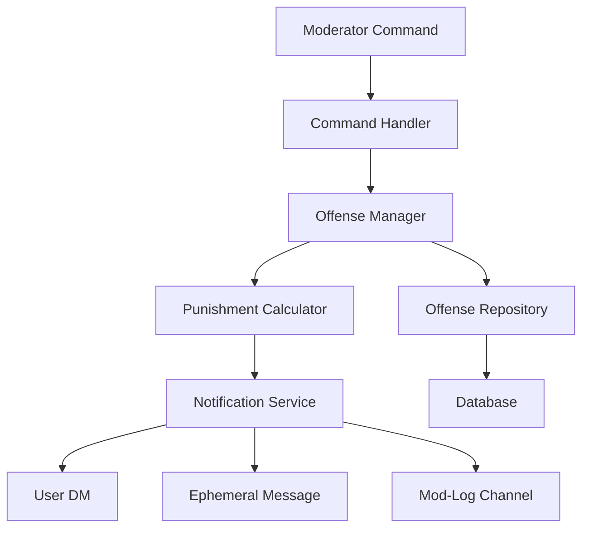

# Design Document: Progressive Spam Punishment

## Overview

The Progressive Spam Punishment system implements an automated escalation ladder for spam offenses with automatic forgiveness after 30 days of good behavior. The system tracks offense history, calculates appropriate punishments, and delivers notifications through three channels (DM, ephemeral message, mod-log).

The design follows a layered architecture:
- **Data Layer**: Persistent storage of offense records
- **Business Logic Layer**: Punishment calculation and offense management
- **Notification Layer**: Triple notification delivery
- **Command Layer**: Moderator interface

## Architecture



### Component Responsibilities

- **Command Handler**: Validates moderator commands and extracts parameters
- **Offense Manager**: Orchestrates offense processing, reset logic, and punishment application
- **Punishment Calculator**: Determines appropriate punishment based on offense count
- **Offense Repository**: Handles database operations for offense records
- **Notification Service**: Delivers triple notifications with failure handling

## Components and Interfaces

### OffenseRecord

```typescript
interface OffenseRecord {
  user_id: string;
  total_offenses: number;
  last_offense_timestamp: Date;
  current_timeout_duration: number; // in hours
  warning_history: OffenseEntry[];
  is_banned: boolean;
}

interface OffenseEntry {
  timestamp: Date;
  reason: string;
  punishment_applied: PunishmentType;
  moderator_id: string;
}

enum PunishmentType {
  WARNING = 'WARNING',
  TIMEOUT = 'TIMEOUT',
  PERMANENT_BAN = 'PERMANENT_BAN'
}
```

### OffenseRepository

```typescript
interface OffenseRepository {
  // Retrieve offense record for a user
  getOffenseRecord(userId: string): Promise<OffenseRecord | null>;
  
  // Create or update offense record
  saveOffenseRecord(record: OffenseRecord): Promise<void>;
  
  // Get all users with active offenses
  getAllActiveOffenses(): Promise<OffenseRecord[]>;
  
  // Clear most recent offense
  removeLastOffense(userId: string): Promise<void>;
  
  // Reset all offenses for a user
  resetOffenses(userId: string): Promise<void>;
}
```

### PunishmentCalculator

```typescript
interface PunishmentCalculator {
  // Calculate punishment based on offense count
  calculatePunishment(offenseCount: number, previousTimeout: number): Punishment;
  
  // Check if reset period has elapsed
  shouldResetOffenses(lastOffenseTimestamp: Date): boolean;
}

interface Punishment {
  type: PunishmentType;
  duration?: number; // in hours, undefined for warnings and bans
  nextPunishment: string; // description of next punishment
}
```

### OffenseManager

```typescript
interface OffenseManager {
  // Process a new offense
  processOffense(userId: string, reason: string, moderatorId: string): Promise<void>;
  
  // Get offense history for a user
  getOffenseHistory(userId: string): Promise<OffenseRecord | null>;
  
  // Clear last offense
  clearLastOffense(userId: string): Promise<void>;
  
  // Reset all offenses
  resetAllOffenses(userId: string): Promise<void>;
}
```

### NotificationService

```typescript
interface NotificationService {
  // Send triple notification
  sendPunishmentNotification(
    userId: string,
    channelId: string,
    punishment: Punishment,
    reason: string,
    offenseCount: number
  ): Promise<NotificationResult>;
}

interface NotificationResult {
  dmSent: boolean;
  ephemeralSent: boolean;
  modLogSent: boolean;
  failures: string[];
}
```

## Data Models

### Database Schema

```sql
CREATE TABLE offense_records (
  user_id TEXT PRIMARY KEY,
  total_offenses INTEGER NOT NULL DEFAULT 0,
  last_offense_timestamp TIMESTAMP,
  current_timeout_duration INTEGER NOT NULL DEFAULT 0,
  is_banned BOOLEAN NOT NULL DEFAULT FALSE,
  created_at TIMESTAMP NOT NULL DEFAULT CURRENT_TIMESTAMP,
  updated_at TIMESTAMP NOT NULL DEFAULT CURRENT_TIMESTAMP
);

CREATE TABLE offense_entries (
  id INTEGER PRIMARY KEY AUTOINCREMENT,
  user_id TEXT NOT NULL,
  timestamp TIMESTAMP NOT NULL DEFAULT CURRENT_TIMESTAMP,
  reason TEXT NOT NULL,
  punishment_applied TEXT NOT NULL,
  moderator_id TEXT NOT NULL,
  FOREIGN KEY (user_id) REFERENCES offense_records(user_id) ON DELETE CASCADE
);

CREATE INDEX idx_offense_records_last_offense ON offense_records(last_offense_timestamp);
CREATE INDEX idx_offense_entries_user_id ON offense_entries(user_id);
```

### Punishment Ladder Logic

The punishment calculation follows this ladder:

| Offense Count | Punishment Type | Duration |
|--------------|----------------|----------|
| 1 | WARNING | - |
| 2 | WARNING | - |
| 3 | TIMEOUT | 1 hour |
| 4 | TIMEOUT | 2 hours |
| 5 | TIMEOUT | 4 hours |
| 6 | TIMEOUT | 8 hours |
| 7 | TIMEOUT | 16 hours |
| 8+ | PERMANENT_BAN | - |

The system applies a permanent ban when the calculated timeout would be ≥24 hours.

### Reset Logic

```typescript
function shouldResetOffenses(lastOffenseTimestamp: Date): boolean {
  const now = new Date();
  const daysSinceLastOffense = (now.getTime() - lastOffenseTimestamp.getTime()) / (1000 * 60 * 60 * 24);
  return daysSinceLastOffense >= 30;
}
```

## Correctness Properties

This section defines testable properties that the Progressive Spam Punishment system must satisfy. These properties will be validated using property-based testing.

### Property 1: Punishment Escalation Monotonicity

**Validates: Requirements 1.1-1.7**

For any user, the punishment severity must never decrease as offense count increases (within the 30-day window).

```typescript
property("punishment severity is monotonically increasing", 
  forAll(userId, offenseSequence, (userId, offenses) => {
    let previousSeverity = 0;
    for (const offense of offenses) {
      const punishment = calculatePunishment(offense.count, offense.previousTimeout);
      const currentSeverity = getSeverity(punishment.type);
      assert(currentSeverity >= previousSeverity);
      previousSeverity = currentSeverity;
    }
  })
);
```

### Property 2: Timeout Duration Doubling

**Validates: Requirements 1.4-1.6, 8.1-8.4**

For offenses 3 through 7, each timeout duration must be exactly double the previous timeout duration.

```typescript
property("timeout duration doubles correctly", 
  forAll(offenseCount, previousTimeout, (count, prevTimeout) => {
    if (count >= 4 && count <= 7) {
      const punishment = calculatePunishment(count, prevTimeout);
      assert(punishment.duration === prevTimeout * 2);
    }
  })
);
```

### Property 3: 30-Day Reset Correctness

**Validates: Requirements 2.1-2.3**

If 30 or more days have passed since the last offense, the next offense must be treated as the first offense (warning only).

```typescript
property("30-day reset clears offense history", 
  forAll(userId, lastOffenseDate, newOffenseDate, (userId, lastDate, newDate) => {
    const daysDiff = (newDate - lastDate) / (1000 * 60 * 60 * 24);
    if (daysDiff >= 30) {
      const record = getOffenseRecord(userId);
      const shouldReset = shouldResetOffenses(lastDate);
      assert(shouldReset === true);
      
      // After reset, next offense should be treated as first
      const punishment = calculatePunishment(1, 0);
      assert(punishment.type === PunishmentType.WARNING);
      assert(punishment.duration === undefined);
    }
  })
);
```

### Property 4: Ban Threshold Enforcement

**Validates: Requirements 1.7, 8.5**

When calculated timeout duration reaches or exceeds 24 hours, a permanent ban must be applied instead of a timeout.

```typescript
property("ban applied when timeout >= 24 hours", 
  forAll(offenseCount, previousTimeout, (count, prevTimeout) => {
    const punishment = calculatePunishment(count, prevTimeout);
    if (punishment.duration && punishment.duration >= 24) {
      assert(punishment.type === PunishmentType.PERMANENT_BAN);
      assert(punishment.duration === undefined);
    }
  })
);
```

### Property 5: Offense Count Persistence

**Validates: Requirements 4.1-4.6**

All offense data must persist across system restarts and be retrievable.

```typescript
property("offense data persists correctly", 
  forAll(userId, offenseData, async (userId, data) => {
    // Save offense record
    await offenseRepo.saveOffenseRecord(data);
    
    // Simulate restart by creating new repository instance
    const newRepo = new OffenseRepository(pool);
    const retrieved = await newRepo.getOffenseRecord(userId);
    
    assert(retrieved !== null);
    assert(retrieved.user_id === data.user_id);
    assert(retrieved.total_offenses === data.total_offenses);
    assert(retrieved.current_timeout_duration === data.current_timeout_duration);
    assert(retrieved.is_banned === data.is_banned);
  })
);
```

### Property 6: Triple Notification Delivery

**Validates: Requirements 3.1-3.4**

Every punishment must attempt to send all three notifications (DM, ephemeral, mod-log), and failures must be logged without blocking punishment application.

```typescript
property("triple notification always attempted", 
  forAll(userId, channelId, punishment, async (userId, channelId, punishment) => {
    const result = await notificationService.sendPunishmentNotification(
      userId, channelId, punishment, "test reason", 1
    );
    
    // All three notification attempts must be recorded
    assert(typeof result.dmSent === 'boolean');
    assert(typeof result.ephemeralSent === 'boolean');
    assert(typeof result.modLogSent === 'boolean');
    
    // Failures must be logged
    if (!result.dmSent || !result.ephemeralSent || !result.modLogSent) {
      assert(result.failures.length > 0);
    }
  })
);
```

### Property 7: First Two Offenses Are Warnings

**Validates: Requirements 1.1-1.2**

The first and second offenses must always result in warnings with no timeout, regardless of timing.

```typescript
property("first two offenses are always warnings", 
  forAll(userId, (userId) => {
    // First offense
    const punishment1 = calculatePunishment(1, 0);
    assert(punishment1.type === PunishmentType.WARNING);
    assert(punishment1.duration === undefined);
    
    // Second offense
    const punishment2 = calculatePunishment(2, 0);
    assert(punishment2.type === PunishmentType.WARNING);
    assert(punishment2.duration === undefined);
  })
);
```

### Property 8: Third Offense Timeout Duration

**Validates: Requirements 1.3, 8.1**

The third offense must always result in exactly a 1-hour timeout.

```typescript
property("third offense is 1-hour timeout", 
  forAll(userId, (userId) => {
    const punishment = calculatePunishment(3, 0);
    assert(punishment.type === PunishmentType.TIMEOUT);
    assert(punishment.duration === 1);
  })
);
```

### Property 9: Offense History Immutability

**Validates: Requirements 4.5**

Once an offense is recorded in the warning_history, it cannot be modified (only removed via clearLastOffense or reset).

```typescript
property("offense history entries are immutable", 
  forAll(userId, offenseEntry, async (userId, entry) => {
    await offenseRepo.saveOffenseRecord({
      user_id: userId,
      total_offenses: 1,
      last_offense_timestamp: entry.timestamp,
      current_timeout_duration: 0,
      warning_history: [entry],
      is_banned: false
    });
    
    const record = await offenseRepo.getOffenseRecord(userId);
    const originalEntry = record.warning_history[0];
    
    // Attempt to modify should fail or be ignored
    originalEntry.reason = "modified";
    
    const recordAfter = await offenseRepo.getOffenseRecord(userId);
    assert(recordAfter.warning_history[0].reason === entry.reason);
  })
);
```

### Property 10: Clear Last Offense Recalculation

**Validates: Requirements 7.1-7.2**

When the last offense is cleared, the user's punishment status must be recalculated based on remaining offenses.

```typescript
property("clearing last offense recalculates status", 
  forAll(userId, async (userId) => {
    // Setup: User has 3 offenses (should be at 1h timeout)
    const record = await offenseRepo.getOffenseRecord(userId);
    const originalCount = record.total_offenses;
    
    // Clear last offense
    await offenseManager.clearLastOffense(userId);
    
    const updatedRecord = await offenseRepo.getOffenseRecord(userId);
    assert(updatedRecord.total_offenses === originalCount - 1);
    
    // Next punishment should be based on new count
    const nextPunishment = calculatePunishment(
      updatedRecord.total_offenses + 1,
      updatedRecord.current_timeout_duration
    );
    // Verify punishment matches the reduced offense count
  })
);
```

## Testing Framework

The system will use **fast-check** (for TypeScript/JavaScript) as the property-based testing library. Tests will be organized in:

- `tests/property/offense-manager.property.test.ts` - Core punishment logic properties
- `tests/property/offense-repository.property.test.ts` - Data persistence properties
- `tests/property/notification-service.property.test.ts` - Notification delivery properties

## Implementation Notes

1. **Timeout Duration Storage**: Store timeout duration in hours as an integer to avoid floating-point precision issues
2. **Timestamp Precision**: Use millisecond precision for all timestamps to ensure accurate 30-day calculations
3. **Concurrent Offense Handling**: Use database transactions to prevent race conditions when multiple offenses occur simultaneously
4. **Notification Failure Handling**: All notification failures must be logged but must not prevent punishment application
5. **Ban Permanence**: Banned users cannot have their ban status automatically removed; only manual moderator intervention via `/resetoffenses` can clear a ban

