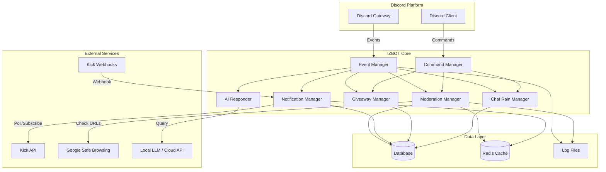

# Design Document: TZBOT Discord Bot

## Overview

TZBOT is a comprehensive Discord moderation and engagement bot built using Discord.js (Node.js) or discord.py (Python). The system integrates with Kick.com's streaming platform API to provide live notifications, automated role synchronization, advanced moderation features, and community engagement tools.

The bot follows a modular, event-driven architecture with clear separation between:
- Discord event handling
- Kick.com API integration
- Moderation logic
- Database persistence
- Optional AI/LLM integration

**Key Design Principles:**
- Event-driven architecture for real-time responsiveness
- Modular components for maintainability
- Graceful degradation when external services are unavailable
- Comprehensive logging and error handling
- Security-first approach for data handling

## Architecture

### High-Level Architecture



### Component Responsibilities

**Event Manager:**
- Receives all Discord events (messages, reactions, joins, etc.)
- Routes events to appropriate managers
- Implements rate limiting and event queuing
- Handles reconnection logic

**Command Manager:**
- Registers and handles slash commands
- Validates command permissions
- Provides command response formatting
- Implements command cooldowns

**Moderation Manager:**
- Spam detection and escalation
- Link scanning and phishing detection
- Channel access enforcement
- Violation tracking and punishment application

**Notification Manager:**
- Monitors Kick.com for events (webhooks + polling fallback)
- Formats and delivers premium embeds
- Handles delivery failures and retries
- Manages notification channels

**Giveaway Manager:**
- Creates and manages giveaway state
- Handles entry validation and role checking
- Performs CSPRNG-based winner selection
- Announces winners and sends notifications

**Chat Rain Manager:**
- Tracks active chatters
- Schedules and executes reward drops
- Filters spam accounts
- Ensures fair distribution

**AI Responder:**
- Processes natural language questions
- Queries local LLM or cloud API
- Maintains knowledge base
- Implements confidence thresholds

## Components and Interfaces

### 1. Discord Client Interface

```typescript
interface DiscordClient {
  // Connection management
  connect(token: string): Promise<void>
  disconnect(): Promise<void>
  
  // Event subscription
  on(event: DiscordEvent, handler: EventHandler): void
  
  // Message operations
  sendMessage(channelId: string, content: MessageContent): Promise<Message>
  deleteMessage(messageId: string): Promise<void>
  
  // Moderation operations
  banUser(userId: string, reason: string): Promise<void>
  kickUser(userId: string, reason: string): Promise<void>
  timeoutUser(userId: string, duration: number, reason: string): Promise<void>
  
  // Role operations
  addRole(userId: string, roleId: string): Promise<void>
  removeRole(userId: string, roleId: string): Promise<void>
  
  // Slash command registration
  registerCommand(command: SlashCommand): Promise<void>
}
```

### 2. Kick API Client

```typescript
interface KickAPIClient {
  // Authentication
  authenticate(apiKey: string): Promise<void>
  
  // Subscriber/VIP data
  getSubscribers(channelId: string): Promise<Subscriber[]>
  getVIPs(channelId: string): Promise<VIP[]>
  
  // Stream events
  getStreamStatus(channelId: string): Promise<StreamStatus>
  getLiveEvents(channelId: string, since: Date): Promise<Event[]>
  
  // Webhook management
  registerWebhook(url: string, events: string[]): Promise<WebhookRegistration>
  deleteWebhook(webhookId: string): Promise<void>
}
```

### 3. Moderation System

```typescript
interface ModerationSystem {
  // Spam detection
  checkSpam(message: Message, userId: string): Promise<SpamResult>
  
  // Link scanning
  scanLinks(message: Message): Promise<LinkScanResult>
  
  // Violation tracking
  recordViolation(userId: string, type: ViolationType): Promise<void>
  getViolationCount(userId: string, window: TimeWindow): Promise<number>
  
  // Punishment application
  applyPunishment(userId: string, level: PunishmentLevel): Promise<void>
  
  // Channel enforcement
  checkChannelAccess(userId: string, channelId: string): Promise<boolean>
}
```

### 4. Database Interface

```typescript
interface Database {
  // User data
  saveUser(user: User): Promise<void>
  getUser(userId: string): Promise<User | null>
  
  // Violation tracking
  saveViolation(violation: Violation): Promise<void>
  getViolations(userId: string, since: Date): Promise<Violation[]>
  clearViolations(userId: string): Promise<void>
  
  // Giveaway data
  saveGiveaway(giveaway: Giveaway): Promise<void>
  getGiveaway(giveawayId: string): Promise<Giveaway | null>
  addGiveawayEntry(giveawayId: string, userId: string): Promise<void>
  
  // Chat rain tracking
  recordChatActivity(userId: string, timestamp: Date): Promise<void>
  getActiveChatters(since: Date): Promise<string[]>
  recordChatRainWinner(userId: string, timestamp: Date): Promise<void>
  
  // Configuration
  getConfig(key: string): Promise<any>
  setConfig(key: string, value: any): Promise<void>
}
```

### 5. CSPRNG Interface

```typescript
interface CSPRNGService {
  // Random number generation
  randomInt(min: number, max: number): number
  
  // Random selection
  selectRandom<T>(items: T[], count: number): T[]
  
  // Shuffle
  shuffle<T>(items: T[]): T[]
}
```

## Data Models

### User Model

```typescript
interface User {
  discordId: string
  kickUsername?: string
  roles: string[]
  violations: Violation[]
  lastChatRainWin?: Date
  createdAt: Date
  updatedAt: Date
}
```

### Violation Model

```typescript
interface Violation {
  id: string
  userId: string
  type: ViolationType
  severity: number
  timestamp: Date
  details: string
  punishmentApplied?: PunishmentLevel
}

enum ViolationType {
  SPAM = 'spam',
  MALICIOUS_LINK = 'malicious_link',
  UNAUTHORIZED_POST = 'unauthorized_post',
  OTHER = 'other'
}

enum PunishmentLevel {
  WARNING = 'warning',
  TIMEOUT_1H = 'timeout_1h',
  TIMEOUT_24H = 'timeout_24h',
  BAN = 'ban'
}
```

### Giveaway Model

```typescript
interface Giveaway {
  id: string
  title: string
  description: string
  channelId: string
  messageId: string
  requiredRoles: string[]
  winnerCount: number
  entries: GiveawayEntry[]
  status: GiveawayStatus
  endsAt: Date
  createdAt: Date
}

interface GiveawayEntry {
  userId: string
  timestamp: Date
}

enum GiveawayStatus {
  ACTIVE = 'active',
  ENDED = 'ended',
  CANCELLED = 'cancelled'
}
```

### Notification Event Model

```typescript
interface NotificationEvent {
  id: string
  type: EventType
  channelId: string
  data: any
  timestamp: Date
  delivered: boolean
}

enum EventType {
  STREAM_LIVE = 'stream_live',
  STREAM_OFFLINE = 'stream_offline',
  NEW_SUBSCRIBER = 'new_subscriber',
  NEW_VIP = 'new_vip',
  RAID = 'raid',
  HOST = 'host'
}
```

### Configuration Model

```typescript
interface BotConfig {
  // Discord settings
  discordToken: string
  guildId: string
  
  // Kick integration
  kickApiKey?: string
  kickChannelId?: string
  kickWebhookUrl?: string
  
  // Notification settings
  notificationChannelId: string
  fallbackChannelId?: string
  
  // Role mappings
  subscriberRoleId: string
  vipRoleId: string
  moderatorRoleId: string
  
  // Moderation settings
  readOnlyChannels: string[]
  spamThreshold: SpamThreshold
  linkScanningEnabled: boolean
  googleSafeBrowsingApiKey?: string
  
  // AI settings
  aiEnabled: boolean
  aiProvider: 'local' | 'openai' | 'anthropic'
  aiApiKey?: string
  aiModelName?: string
  aiChannels: string[]
  
  // Chat rain settings
  chatRainEnabled: boolean
  chatRainMinDelay: number
  chatRainActiveWindow: number
  
  // Performance settings
  maxMessagesPerSecond: number
  cacheEnabled: boolean
  redisCacheUrl?: string
}

interface SpamThreshold {
  identicalMessages: number
  identicalWindow: number
  rapidMessages: number
  rapidWindow: number
}
```

## Correctness Properties

*A property is a characteristic or behavior that should hold true across all valid executions of a system—essentially, a formal statement about what the system should do. Properties serve as the bridge between human-readable specifications and machine-verifiable correctness guarantees.*

Before defining the correctness properties, let me analyze the acceptance criteria from the requirements document:


### Property Reflection

After analyzing all acceptance criteria, I've identified several areas where properties can be consolidated:

**Consolidation Opportunities:**
1. Role sync properties (2.1-2.4) can be combined into a single property about role synchronization timing
2. Spam escalation properties (4.1-4.4) can be combined into a single property about escalation levels
3. Moderation command properties (5.1-5.4) can be combined into a single property about command execution
4. Logging properties (3.5, 5.6, 7.6, 8.6, 14.5) can be combined into a single property about log completeness
5. CSPRNG properties (9.3, 11.3) can be combined into a single property about random selection
6. Timing properties for various operations can be grouped by similar time bounds

**Properties to Keep Separate:**
- URL normalization (7.4) - unique transformation property
- Duplicate prevention (9.6) - unique constraint property
- Rate limiting (10.8, 15.6) - different contexts require separate properties
- Failover logic (8.3, 8.5) - state transition properties

### Correctness Properties

Property 1: Notification Delivery Timing
*For any* notification event from Kick platform, the Premium_Embed should be delivered to the designated channel within 1 second of the event occurring.
**Validates: Requirements 1.1**

Property 2: Embed Structure Completeness
*For any* Premium_Embed generated by the system, it should contain all required fields: title, description, thumbnail, timestamp, and color.
**Validates: Requirements 1.2**

Property 3: Chronological Event Ordering
*For any* set of notification events with timestamps, the delivery order of Premium_Embeds should match the chronological order of the events.
**Validates: Requirements 1.3**

Property 4: Channel Targeting Accuracy
*For any* notification event with a designated channel configured, the Premium_Embed should only be sent to that specific channel and no others.
**Validates: Requirements 1.4**

Property 5: Fallback Channel Delivery
*For any* notification event where the designated channel is inaccessible, the system should log an error and attempt delivery to the configured fallback channel.
**Validates: Requirements 1.5**

Property 6: Role Synchronization Timing
*For any* user status change on Kick platform (subscriber/VIP gain or loss), the corresponding Discord role should be added or removed within 60 seconds.
**Validates: Requirements 2.1, 2.2, 2.3, 2.4**

Property 7: User Mapping Persistence
*For any* user with both a Kick username and Discord ID, the mapping between these identifiers should be maintained in the database and retrievable.
**Validates: Requirements 2.5**

Property 8: Sync Failure Recovery
*For any* role synchronization attempt where the Discord user cannot be found, the system should log the failure and retry on the next sync cycle.
**Validates: Requirements 2.6**

Property 9: Unauthorized Message Deletion
*For any* message posted by a non-authorized user in a read-only channel, the message should be deleted within 1 second.
**Validates: Requirements 3.1**

Property 10: Deletion Notification
*For any* message deleted from a read-only channel, a direct message explaining the restriction should be sent to the user who posted it.
**Validates: Requirements 3.2**

Property 11: Moderator Exemption
*For any* message posted by a user with moderator permissions in a read-only channel, the message should not be deleted.
**Validates: Requirements 3.3**

Property 12: Whitelist Role Access
*For any* user with a whitelist role for a specific read-only channel, their messages in that channel should not be deleted.
**Validates: Requirements 3.4**

Property 13: Spam Escalation Matrix
*For any* user with N spam violations within the specified time windows, the punishment level should match the escalation matrix: 1st = warning, 2nd (24h) = 1h timeout, 3rd (24h) = 24h timeout, 4th (7d) = ban.
**Validates: Requirements 4.1, 4.2, 4.3, 4.4**

Property 14: Spam Detection Criteria
*For any* sequence of messages from a user, spam should be detected if either: 5+ identical messages within 10 seconds, or 10+ messages within 5 seconds.
**Validates: Requirements 4.5**

Property 15: Violation Expiry
*For any* user with no violations for 7 consecutive days, their violation count should be reset to zero.
**Validates: Requirements 4.6**

Property 16: Punishment Notification
*For any* punishment applied to a user, a direct message should be sent to that user containing the reason and duration (if applicable).
**Validates: Requirements 4.7**

Property 17: Moderation Command Execution
*For any* moderation slash command (/ban, /timeout, /warn, /kick) executed by a moderator, the corresponding action should be performed within 1 second.
**Validates: Requirements 5.1, 5.2, 5.3, 5.4, 5.5**

Property 18: Moderation Command Confirmation
*For any* moderation slash command executed, a confirmation message should be sent to the moderator who executed it.
**Validates: Requirements 5.7**

Property 19: Announcement Relay Timing
*For any* message posted by a moderator in the designated private channel, the message should be relayed to all configured public channels within 2 seconds.
**Validates: Requirements 6.1**

Property 20: Message Content Preservation
*For any* relayed message, all formatting, embeds, and attachments from the original message should be preserved in the relayed version.
**Validates: Requirements 6.2**

Property 21: Relay Attribution
*For any* relayed message, the author should be displayed as TZBOT, not the original moderator.
**Validates: Requirements 6.3**

Property 22: Multi-Channel Relay
*For any* message to be relayed with multiple public channels configured, the message should be sent to all configured channels.
**Validates: Requirements 6.4**

Property 23: Relay Failure Notification
*For any* relay attempt that fails, a notification should be sent to the moderator in the private channel.
**Validates: Requirements 6.5**

Property 24: Zero-Width Link Detection
*For any* message containing a URL with zero-width Unicode characters (U+200B, U+200C, U+200D, U+FEFF), the message should be deleted within 500 milliseconds.
**Validates: Requirements 7.1**

Property 25: Blocklist Link Detection
*For any* message containing a URL from the phishing blocklist, the message should be deleted within 500 milliseconds.
**Validates: Requirements 7.2**

Property 26: Malicious Link Punishment
*For any* message with a detected malicious link, a 24-hour timeout should be applied to the user who posted it.
**Validates: Requirements 7.3**

Property 27: URL Normalization
*For any* URL being analyzed, all zero-width Unicode characters (U+200B, U+200C, U+200D, U+FEFF) should be removed before further processing.
**Validates: Requirements 7.4**

Property 28: Moderator Link Exemption
*For any* message posted by a moderator, link detection and scanning should be skipped.
**Validates: Requirements 7.7**

Property 29: External URL Scanning
*For any* URL in a message (after normalization), it should be checked against the Google Safe Browsing API for phishing detection.
**Validates: Requirements 7.8**

Property 30: Webhook-to-Polling Failover
*For any* monitoring system state where webhooks fail for 3 consecutive events or 60 seconds, the polling system should be activated as a fallback.
**Validates: Requirements 8.3**

Property 31: Polling Frequency
*For any* time period while the polling system is active, the Kick platform API should be checked every 10 seconds for new events.
**Validates: Requirements 8.4**

Property 32: Polling-to-Webhook Recovery
*For any* monitoring system state where webhooks resume functioning after polling was activated, the polling system should be deactivated.
**Validates: Requirements 8.5**

Property 33: Giveaway Role Restriction
*For any* giveaway configured with whitelist roles, only users possessing at least one of those roles should be able to enter.
**Validates: Requirements 9.1**

Property 34: Giveaway Entry Rejection
*For any* user without required whitelist roles attempting to enter a giveaway, an ephemeral message explaining the restriction should be sent.
**Validates: Requirements 9.2**

Property 35: Entry Recording
*For any* user clicking a giveaway entry button, an entry record should be created containing the user ID and timestamp.
**Validates: Requirements 9.5**

Property 36: Duplicate Entry Prevention
*For any* giveaway, each user should have at most one entry recorded, regardless of how many times they click the entry button.
**Validates: Requirements 9.6**

Property 37: Winner Notification
*For any* completed giveaway, winners should be announced in the giveaway channel and each winner should receive a direct message.
**Validates: Requirements 9.7**

Property 38: AI Response Timing
*For any* question detected in a configured AI channel, a response should be generated and sent within 10 seconds.
**Validates: Requirements 10.3**

Property 39: Question Detection
*For any* message in an AI-enabled channel, a response should only be generated if the message ends with a question mark or contains question keywords (who, what, when, where, why, how).
**Validates: Requirements 10.4**

Property 40: Confidence Thresholding
*For any* AI-generated response with a confidence score below 0.7, the response should be suppressed and not sent.
**Validates: Requirements 10.5**

Property 41: AI Response Deletion
*For any* AI response that receives a ❌ emoji reaction from a moderator, the response should be deleted.
**Validates: Requirements 10.7**

Property 42: AI Rate Limiting
*For any* user in an AI-enabled channel, AI responses should be limited to at most 1 response per 30-second period.
**Validates: Requirements 10.8**

Property 43: Active Chatter Tracking
*For any* user, they should be classified as an active chatter if and only if they have sent at least 3 messages in the last 10 minutes.
**Validates: Requirements 11.1**

Property 44: Chat Rain Recipient Count
*For any* chat rain event, the number of recipients selected should be between 3 and 10 (inclusive).
**Validates: Requirements 11.2**

Property 45: Spam Filter Exclusion
*For any* chat rain event, users who have been flagged by the spam filter in the last 24 hours should be excluded from eligibility.
**Validates: Requirements 11.4**

Property 46: Chat Rain Minimum Delay
*For any* two consecutive chat rain events, they should be separated by at least 5 minutes.
**Validates: Requirements 11.5**

Property 47: Chat Rain Delayed Execution
*For any* chat rain event configured with a time delay, the reward distribution should occur after waiting the specified duration.
**Validates: Requirements 11.6**

Property 48: Chat Rain Winner Announcement
*For any* chat rain event, an announcement listing the winners should be posted in the chat channel.
**Validates: Requirements 11.7**

Property 49: Chat Rain Cooldown
*For any* chat rain event, users who received a reward in the last 60 minutes should be excluded from the draw.
**Validates: Requirements 11.8**

Property 50: CSPRNG Usage
*For any* random selection operation (giveaway winners, chat rain recipients), a cryptographically secure pseudo-random number generator should be used.
**Validates: Requirements 9.3, 11.3**

Property 51: Configuration Validation
*For any* configuration loaded at startup, all values should be validated and invalid configurations should be rejected with specific error messages.
**Validates: Requirements 12.2, 12.3**

Property 52: Configuration Hot-Reload
*For any* configuration change made while the bot is running, the new configuration should be applied without requiring a restart.
**Validates: Requirements 12.4**

Property 53: Configuration Display
*For any* /config command executed by a moderator, the current configuration values should be displayed in the response.
**Validates: Requirements 12.5**

Property 54: Sensitive Data Encryption
*For any* sensitive configuration value (API keys, tokens, passwords), the value should be encrypted using AES-256 when stored at rest.
**Validates: Requirements 12.6, 15.1**

Property 55: Resource Threshold Warning
*For any* system state where resource usage (RAM or CPU) exceeds 80% of configured limits, a warning should be logged and rate limiting should be implemented.
**Validates: Requirements 13.5**

Property 56: State Persistence Frequency
*For any* 60-second time interval during bot operation, all critical state data should be persisted to disk at least once.
**Validates: Requirements 14.3**

Property 57: State Recovery
*For any* bot restart, the system should restore its state from the most recently persisted data.
**Validates: Requirements 14.4**

Property 58: Exponential Backoff
*For any* failed API request, retry attempts should use exponential backoff starting at 1 second and capping at 60 seconds.
**Validates: Requirements 14.6**

Property 59: Message Retention Limit
*For any* message content stored in the database, it should be deleted after 7 days unless it is part of a moderation log.
**Validates: Requirements 15.2**

Property 60: Data Minimization
*For any* user record stored in the database, it should contain only the Discord user ID and not any personal information.
**Validates: Requirements 15.3**

Property 61: User Data Deletion
*For any* user executing the /deletemydata command, all stored data associated with that user should be removed from the database.
**Validates: Requirements 15.4**

Property 62: Password Hashing
*For any* password or sensitive credential stored in the database, it should be hashed using bcrypt with a cost factor of at least 12.
**Validates: Requirements 15.5**

Property 63: API Rate Limiting
*For any* user making API requests, the requests should be limited to a maximum of 60 requests per minute.
**Validates: Requirements 15.6**

Property 64: Breach Notification
*For any* detected data breach, the incident should be logged and all configured administrators should be notified immediately.
**Validates: Requirements 15.7**

Property 65: Comprehensive Logging
*For any* significant system event (moderation action, error, state transition, malicious link detection), a log entry should be created containing all relevant context (user IDs, timestamps, details, stack traces where applicable).
**Validates: Requirements 3.5, 5.6, 7.6, 8.6, 14.5**

## Error Handling

### Error Categories

**1. External Service Failures:**
- Kick API unavailable
- Discord API rate limiting
- Google Safe Browsing API timeout
- LLM service unavailable

**Strategy:** Implement exponential backoff, fallback mechanisms (webhook → polling), and graceful degradation. Log all failures with context.

**2. Data Integrity Errors:**
- Database connection lost
- Corrupted state data
- Invalid configuration

**Strategy:** Validate all data before use, maintain transaction logs, implement automatic rollback on corruption detection.

**3. Permission Errors:**
- Bot lacks required Discord permissions
- User attempts unauthorized action
- Channel access denied

**Strategy:** Check permissions before operations, provide clear error messages to users, log permission issues for admin review.

**4. Resource Exhaustion:**
- Memory limit exceeded
- CPU threshold breached
- Rate limit hit

**Strategy:** Implement resource monitoring, automatic rate limiting, queue management, and alert administrators.

### Error Recovery Patterns

```typescript
// Exponential backoff for API calls
async function callWithBackoff<T>(
  fn: () => Promise<T>,
  maxRetries: number = 5
): Promise<T> {
  let delay = 1000; // Start at 1 second
  
  for (let attempt = 0; attempt < maxRetries; attempt++) {
    try {
      return await fn();
    } catch (error) {
      if (attempt === maxRetries - 1) throw error;
      
      await sleep(delay);
      delay = Math.min(delay * 2, 60000); // Cap at 60 seconds
    }
  }
  
  throw new Error('Max retries exceeded');
}

// Graceful degradation for notifications
async function sendNotification(event: NotificationEvent): Promise<void> {
  try {
    // Try primary channel
    await sendToChannel(event.channelId, event.embed);
  } catch (error) {
    logger.error('Primary channel failed', { error, event });
    
    try {
      // Try fallback channel
      if (config.fallbackChannelId) {
        await sendToChannel(config.fallbackChannelId, event.embed);
      }
    } catch (fallbackError) {
      logger.error('Fallback channel also failed', { fallbackError, event });
      // Store for retry later
      await queueForRetry(event);
    }
  }
}
```

## Testing Strategy

### Dual Testing Approach

The testing strategy employs both unit tests and property-based tests to ensure comprehensive coverage:

**Unit Tests:**
- Specific examples demonstrating correct behavior
- Edge cases (empty inputs, boundary values, special characters)
- Error conditions and exception handling
- Integration points between components
- Mock external services (Discord API, Kick API, Google Safe Browsing)

**Property-Based Tests:**
- Universal properties that hold for all inputs
- Randomized input generation (100+ iterations per test)
- Comprehensive coverage through randomization
- Each property test references its design document property
- Tag format: `Feature: tzbot-discord-bot, Property N: [property text]`

### Testing Framework Selection

**For JavaScript/TypeScript (Discord.js):**
- Unit Testing: Jest or Vitest
- Property-Based Testing: fast-check
- Mocking: jest.mock() or vitest.mock()
- Discord API Mocking: @discord.js/mock

**For Python (discord.py):**
- Unit Testing: pytest
- Property-Based Testing: Hypothesis
- Mocking: pytest-mock or unittest.mock
- Discord API Mocking: dpytest

### Property Test Configuration

All property-based tests must:
- Run minimum 100 iterations (due to randomization)
- Include a comment tag referencing the design property
- Use CSPRNG for any random selection within the test
- Test against the actual implementation, not mocks (where feasible)

Example property test structure:

```typescript
// Feature: tzbot-discord-bot, Property 27: URL Normalization
test('URL normalization removes all zero-width characters', () => {
  fc.assert(
    fc.property(
      fc.webUrl(),
      fc.array(fc.constantFrom('\u200B', '\u200C', '\u200D', '\uFEFF')),
      (url, zeroWidthChars) => {
        // Insert zero-width characters at random positions
        const obfuscatedUrl = insertRandomly(url, zeroWidthChars);
        
        // Normalize the URL
        const normalized = normalizeUrl(obfuscatedUrl);
        
        // Verify all zero-width characters are removed
        expect(normalized).not.toMatch(/[\u200B\u200C\u200D\uFEFF]/);
        
        // Verify the URL structure is preserved
        expect(normalized).toContain(url);
      }
    ),
    { numRuns: 100 }
  );
});
```

### Test Organization

```
tests/
├── unit/
│   ├── moderation/
│   │   ├── spam-detection.test.ts
│   │   ├── link-scanning.test.ts
│   │   └── escalation.test.ts
│   ├── notifications/
│   │   ├── embed-formatting.test.ts
│   │   └── delivery.test.ts
│   ├── giveaways/
│   │   ├── entry-validation.test.ts
│   │   └── winner-selection.test.ts
│   └── chat-rain/
│       ├── eligibility.test.ts
│       └── distribution.test.ts
├── property/
│   ├── moderation.property.test.ts
│   ├── notifications.property.test.ts
│   ├── giveaways.property.test.ts
│   ├── chat-rain.property.test.ts
│   ├── csprng.property.test.ts
│   └── security.property.test.ts
└── integration/
    ├── discord-client.test.ts
    ├── kick-api.test.ts
    └── end-to-end.test.ts
```

### Key Testing Priorities

1. **CSPRNG Validation:** Verify all random selection uses cryptographically secure methods
2. **Timing Properties:** Validate all time-bound operations (notification delivery, message deletion, etc.)
3. **Security Properties:** Test encryption, data minimization, rate limiting
4. **Escalation Logic:** Verify spam punishment escalation matrix
5. **Failover Mechanisms:** Test webhook-to-polling transitions
6. **Data Integrity:** Verify round-trip properties for serialization/deserialization

## Missing Design Components Analysis

After deep review, the following critical components need to be added to the design:

### 1. Kick-Discord User Linking System

**Problem:** The design assumes we can map Kick usernames to Discord IDs, but doesn't explain HOW users link their accounts.

**Solution:** Add a user linking flow:

```typescript
interface UserLinkingSystem {
  // User initiates linking
  startLinking(discordUserId: string): Promise<LinkToken>
  
  // User verifies on Kick (via chat command or profile)
  verifyLinking(kickUsername: string, token: string): Promise<boolean>
  
  // Complete the link
  completeLink(discordUserId: string, kickUsername: string): Promise<void>
  
  // Unlink accounts
  unlinkAccounts(discordUserId: string): Promise<void>
}

// Linking flow:
// 1. User runs /link command on Discord
// 2. Bot generates unique token and DMs user
// 3. User types "!verify TOKEN" in Kick chat
// 4. Bot monitors Kick chat for verification
// 5. Bot confirms link and assigns roles
```

**Commands Needed:**
- `/link` - Start linking process
- `/unlink` - Remove account link
- `/checklink` - Verify current link status

### 2. Kick Chat Monitoring System

**Problem:** The design mentions monitoring Kick for events but doesn't detail HOW to monitor Kick chat for verification tokens or chat rain eligibility.

**Solution:** Add Kick chat client:

```typescript
interface KickChatClient {
  // Connect to Kick chat via WebSocket
  connect(channelId: string): Promise<void>
  
  // Subscribe to chat messages
  onMessage(handler: (message: KickChatMessage) => void): void
  
  // Send chat messages (for bot responses)
  sendMessage(channelId: string, message: string): Promise<void>
  
  // Disconnect
  disconnect(): Promise<void>
}

interface KickChatMessage {
  id: string
  username: string
  content: string
  timestamp: Date
  badges: string[] // subscriber, vip, moderator
}
```

**Implementation Note:** Kick uses Pusher for WebSocket chat. Need to:
- Connect to Pusher cluster
- Subscribe to channel chat events
- Parse chat message format
- Handle reconnections

### 3. Giveaway Persistence and Recovery

**Problem:** Design doesn't explain what happens if bot crashes during an active giveaway.

**Solution:** Add giveaway state management:

```typescript
interface GiveawayStateManager {
  // Save giveaway state every time it changes
  saveGiveawayState(giveaway: Giveaway): Promise<void>
  
  // On startup, recover active giveaways
  recoverActiveGiveaways(): Promise<Giveaway[]>
  
  // Schedule giveaway end even after restart
  scheduleGiveawayEnd(giveawayId: string, endsAt: Date): void
  
  // Handle missed giveaway ends (if bot was down)
  processMissedGiveaways(): Promise<void>
}
```

**Recovery Logic:**
1. On startup, load all giveaways with status='active'
2. Check if end time has passed
3. If passed, immediately end giveaway
4. If not passed, reschedule end event

### 4. Chat Rain Reward Distribution

**Problem:** Design mentions "reward distribution" but doesn't specify WHAT rewards are distributed or HOW.

**Solution:** Add reward system:

```typescript
interface RewardSystem {
  // Define reward types
  type RewardType = 'role' | 'currency' | 'announcement' | 'custom'
  
  interface Reward {
    type: RewardType
    value: any // role ID, currency amount, message, etc.
  }
  
  // Distribute rewards to winners
  distributeRewards(userIds: string[], reward: Reward): Promise<void>
  
  // Track reward history
  recordRewardDistribution(
    userId: string,
    reward: Reward,
    timestamp: Date
  ): Promise<void>
}

// Example reward configurations:
// - Temporary "Winner" role for 24 hours
// - Server currency/points (if using economy bot)
// - Special mention in announcement
// - Custom reward via webhook to external system
```

**Configuration Needed:**
```typescript
interface ChatRainConfig {
  enabled: boolean
  minDelay: number // 5 minutes
  activeWindow: number // 10 minutes
  minMessages: number // 3 messages
  rewardType: RewardType
  rewardValue: any
  cooldownMinutes: number // 60 minutes
}
```

### 5. Database Schema

**Problem:** Design shows interfaces but not actual database schema.

**Solution:** Add complete schema:

```sql
-- Users table
CREATE TABLE users (
  discord_id VARCHAR(20) PRIMARY KEY,
  kick_username VARCHAR(100) UNIQUE,
  created_at TIMESTAMP DEFAULT CURRENT_TIMESTAMP,
  updated_at TIMESTAMP DEFAULT CURRENT_TIMESTAMP
);

-- Violations table
CREATE TABLE violations (
  id UUID PRIMARY KEY,
  user_id VARCHAR(20) REFERENCES users(discord_id),
  type VARCHAR(50) NOT NULL,
  severity INTEGER NOT NULL,
  timestamp TIMESTAMP NOT NULL,
  details TEXT,
  punishment_applied VARCHAR(50),
  INDEX idx_user_timestamp (user_id, timestamp)
);

-- Giveaways table
CREATE TABLE giveaways (
  id UUID PRIMARY KEY,
  title VARCHAR(255) NOT NULL,
  description TEXT,
  channel_id VARCHAR(20) NOT NULL,
  message_id VARCHAR(20) NOT NULL,
  required_roles JSON, -- Array of role IDs
  winner_count INTEGER NOT NULL,
  status VARCHAR(20) NOT NULL, -- active, ended, cancelled
  ends_at TIMESTAMP NOT NULL,
  created_at TIMESTAMP DEFAULT CURRENT_TIMESTAMP,
  INDEX idx_status_ends (status, ends_at)
);

-- Giveaway entries table
CREATE TABLE giveaway_entries (
  giveaway_id UUID REFERENCES giveaways(id),
  user_id VARCHAR(20) NOT NULL,
  timestamp TIMESTAMP DEFAULT CURRENT_TIMESTAMP,
  PRIMARY KEY (giveaway_id, user_id)
);

-- Chat activity table (for chat rain)
CREATE TABLE chat_activity (
  user_id VARCHAR(20) NOT NULL,
  timestamp TIMESTAMP NOT NULL,
  PRIMARY KEY (user_id, timestamp),
  INDEX idx_timestamp (timestamp)
);

-- Chat rain winners table
CREATE TABLE chat_rain_winners (
  user_id VARCHAR(20) NOT NULL,
  timestamp TIMESTAMP NOT NULL,
  reward_type VARCHAR(50) NOT NULL,
  reward_value TEXT,
  PRIMARY KEY (user_id, timestamp),
  INDEX idx_user_timestamp (user_id, timestamp)
);

-- Configuration table
CREATE TABLE config (
  key VARCHAR(100) PRIMARY KEY,
  value TEXT NOT NULL,
  updated_at TIMESTAMP DEFAULT CURRENT_TIMESTAMP
);

-- Moderation logs table
CREATE TABLE moderation_logs (
  id UUID PRIMARY KEY,
  moderator_id VARCHAR(20) NOT NULL,
  target_user_id VARCHAR(20) NOT NULL,
  action_type VARCHAR(50) NOT NULL,
  reason TEXT,
  timestamp TIMESTAMP DEFAULT CURRENT_TIMESTAMP,
  INDEX idx_target_timestamp (target_user_id, timestamp)
);

-- Message content table (7-day retention)
CREATE TABLE message_content (
  message_id VARCHAR(20) PRIMARY KEY,
  user_id VARCHAR(20) NOT NULL,
  channel_id VARCHAR(20) NOT NULL,
  content TEXT NOT NULL,
  timestamp TIMESTAMP NOT NULL,
  deleted_at TIMESTAMP,
  INDEX idx_timestamp (timestamp)
);

-- Notification queue table (for retry)
CREATE TABLE notification_queue (
  id UUID PRIMARY KEY,
  event_type VARCHAR(50) NOT NULL,
  event_data JSON NOT NULL,
  channel_id VARCHAR(20) NOT NULL,
  attempts INTEGER DEFAULT 0,
  last_attempt TIMESTAMP,
  created_at TIMESTAMP DEFAULT CURRENT_TIMESTAMP,
  INDEX idx_attempts (attempts, created_at)
);
```

### 6. Rate Limiting Implementation

**Problem:** Design mentions rate limiting but doesn't show implementation.

**Solution:** Add rate limiter:

```typescript
interface RateLimiter {
  // Token bucket algorithm
  checkLimit(
    key: string,
    maxTokens: number,
    refillRate: number
  ): Promise<boolean>
  
  // Consume tokens
  consume(key: string, tokens: number): Promise<boolean>
  
  // Reset limit for a key
  reset(key: string): Promise<void>
}

// Implementation using Redis
class RedisRateLimiter implements RateLimiter {
  async checkLimit(
    key: string,
    maxTokens: number,
    refillRate: number
  ): Promise<boolean> {
    const now = Date.now()
    const bucket = await redis.get(`ratelimit:${key}`)
    
    if (!bucket) {
      await redis.set(
        `ratelimit:${key}`,
        JSON.stringify({ tokens: maxTokens - 1, lastRefill: now })
      )
      return true
    }
    
    const { tokens, lastRefill } = JSON.parse(bucket)
    const timePassed = now - lastRefill
    const tokensToAdd = Math.floor(timePassed / 1000) * refillRate
    const newTokens = Math.min(maxTokens, tokens + tokensToAdd)
    
    if (newTokens < 1) return false
    
    await redis.set(
      `ratelimit:${key}`,
      JSON.stringify({ tokens: newTokens - 1, lastRefill: now })
    )
    return true
  }
}

// Usage:
// - AI responses: 1 per 30 seconds per user
// - Moderation commands: 10 per minute per moderator
// - Giveaway entries: 1 per giveaway per user
// - API requests: 60 per minute per user
```

### 7. Webhook Signature Verification

**Problem:** Design mentions webhook security but doesn't show verification.

**Solution:** Add webhook verification:

```typescript
interface WebhookVerifier {
  // Verify Kick webhook signature
  verifyKickWebhook(
    payload: string,
    signature: string,
    secret: string
  ): boolean
}

class HMACWebhookVerifier implements WebhookVerifier {
  verifyKickWebhook(
    payload: string,
    signature: string,
    secret: string
  ): boolean {
    const hmac = crypto.createHmac('sha256', secret)
    hmac.update(payload)
    const expectedSignature = hmac.digest('hex')
    
    // Constant-time comparison to prevent timing attacks
    return crypto.timingSafeEqual(
      Buffer.from(signature),
      Buffer.from(expectedSignature)
    )
  }
}

// Express middleware for webhook endpoint
app.post('/webhooks/kick', (req, res) => {
  const signature = req.headers['x-kick-signature']
  const payload = JSON.stringify(req.body)
  
  if (!verifier.verifyKickWebhook(payload, signature, webhookSecret)) {
    return res.status(401).json({ error: 'Invalid signature' })
  }
  
  // Process webhook
  notificationManager.handleWebhook(req.body)
  res.status(200).json({ success: true })
})
```

### 8. AI Knowledge Base Management

**Problem:** Design mentions knowledge base but doesn't explain how to populate or update it.

**Solution:** Add knowledge base system:

```typescript
interface KnowledgeBase {
  // Add FAQ entry
  addEntry(question: string, answer: string, tags: string[]): Promise<void>
  
  // Search for relevant entries
  search(query: string, limit: number): Promise<KBEntry[]>
  
  // Update entry
  updateEntry(id: string, answer: string): Promise<void>
  
  // Delete entry
  deleteEntry(id: string): Promise<void>
  
  // Import from file
  importFromFile(filepath: string): Promise<void>
}

interface KBEntry {
  id: string
  question: string
  answer: string
  tags: string[]
  useCount: number
  lastUsed: Date
}

// Commands for moderators:
// /kb add <question> | <answer> | <tags>
// /kb edit <id> <new_answer>
// /kb delete <id>
// /kb search <query>
// /kb import <file_url>

// File format (JSON):
[
  {
    "question": "How do I subscribe?",
    "answer": "Click the Subscribe button below the stream!",
    "tags": ["subscription", "support"]
  },
  {
    "question": "What are the sub benefits?",
    "answer": "Subscribers get: ad-free viewing, custom emotes, and subscriber-only chat!",
    "tags": ["subscription", "benefits"]
  }
]
```

### 9. Monitoring and Health Checks

**Problem:** Design doesn't include system health monitoring.

**Solution:** Add health check system:

```typescript
interface HealthCheckSystem {
  // Check Discord connection
  checkDiscordHealth(): Promise<HealthStatus>
  
  // Check Kick API
  checkKickHealth(): Promise<HealthStatus>
  
  // Check database
  checkDatabaseHealth(): Promise<HealthStatus>
  
  // Check Redis cache
  checkCacheHealth(): Promise<HealthStatus>
  
  // Overall system health
  getSystemHealth(): Promise<SystemHealth>
}

interface HealthStatus {
  healthy: boolean
  latency: number
  lastCheck: Date
  error?: string
}

interface SystemHealth {
  overall: 'healthy' | 'degraded' | 'down'
  components: {
    discord: HealthStatus
    kick: HealthStatus
    database: HealthStatus
    cache: HealthStatus
  }
  uptime: number
  memoryUsage: number
  cpuUsage: number
}

// Expose health endpoint for monitoring
app.get('/health', async (req, res) => {
  const health = await healthCheck.getSystemHealth()
  const statusCode = health.overall === 'healthy' ? 200 : 503
  res.status(statusCode).json(health)
})

// Periodic health checks (every 30 seconds)
setInterval(async () => {
  const health = await healthCheck.getSystemHealth()
  
  if (health.overall === 'down') {
    logger.error('System health critical', health)
    // Alert administrators
    await alertAdmins('System health critical', health)
  }
}, 30000)
```

### 10. Graceful Shutdown

**Problem:** Design doesn't explain how to shut down cleanly.

**Solution:** Add shutdown handler:

```typescript
interface ShutdownManager {
  // Register cleanup function
  registerCleanup(fn: () => Promise<void>): void
  
  // Initiate graceful shutdown
  shutdown(): Promise<void>
}

class GracefulShutdownManager implements ShutdownManager {
  private cleanupFunctions: Array<() => Promise<void>> = []
  
  registerCleanup(fn: () => Promise<void>): void {
    this.cleanupFunctions.push(fn)
  }
  
  async shutdown(): Promise<void> {
    logger.info('Initiating graceful shutdown...')
    
    // Stop accepting new events
    eventManager.pause()
    
    // Wait for in-flight operations to complete (max 30 seconds)
    await this.waitForInflight(30000)
    
    // Run all cleanup functions
    for (const cleanup of this.cleanupFunctions) {
      try {
        await cleanup()
      } catch (error) {
        logger.error('Cleanup error', error)
      }
    }
    
    logger.info('Shutdown complete')
    process.exit(0)
  }
  
  private async waitForInflight(timeout: number): Promise<void> {
    const start = Date.now()
    while (eventManager.hasInflight() && Date.now() - start < timeout) {
      await sleep(100)
    }
  }
}

// Register cleanup functions
shutdownManager.registerCleanup(async () => {
  await discordClient.disconnect()
})

shutdownManager.registerCleanup(async () => {
  await database.close()
})

shutdownManager.registerCleanup(async () => {
  await redis.quit()
})

shutdownManager.registerCleanup(async () => {
  await kickChatClient.disconnect()
})

// Handle shutdown signals
process.on('SIGTERM', () => shutdownManager.shutdown())
process.on('SIGINT', () => shutdownManager.shutdown())
```

## Realistic Limitations and Trade-offs

### 1. Role Synchronization Limitations

**Limitation:** Kick API does not provide real-time subscriber/VIP status webhooks or direct list endpoints.

**Impact:**
- Cannot achieve true "zero-delay" automatic role sync
- Requires users to link accounts manually via /link command
- Role sync only happens when users chat on Kick (badge detection)
- VIP status may not be detectable if Kick doesn't expose VIP badges

**Mitigation:**
- Implement badge-based detection when users chat
- Use kicks.gifted webhook for new subscriptions
- Provide manual /addrole and /removerole commands for moderators
- Document that users must chat on Kick at least once for role sync
- Consider periodic polling of channel data (every 5 minutes) as backup

**Realistic Expectation:** Role sync within 5 minutes of status change, assuming user chats on Kick.

### 2. Live Notification Timing

**Limitation:** Webhook delivery and processing takes time; network latency varies.

**Impact:**
- "Within 1 second" delivery is optimistic
- Actual delivery: 1-3 seconds under normal conditions
- May spike to 5-10 seconds under high load or network issues

**Mitigation:**
- Use webhooks as primary mechanism (fastest)
- Implement efficient event processing pipeline
- Monitor and log actual delivery times
- Alert if delivery times exceed 5 seconds consistently

**Realistic Expectation:** 95% of notifications delivered within 3 seconds.

### 3. AI Response Quality

**Limitation:** LLMs can hallucinate, provide incorrect answers, or misunderstand questions.

**Impact:**
- AI may give wrong information to users
- Confidence scores are not always reliable
- May require significant knowledge base curation

**Mitigation:**
- Set high confidence threshold (0.7+)
- Allow moderators to delete bad responses (❌ reaction)
- Maintain curated knowledge base of approved Q&A
- Log all AI responses for review
- Consider human-in-the-loop for critical questions
- Start with AI disabled, enable after testing

**Realistic Expectation:** 70-80% accuracy on common questions; requires ongoing curation.

### 4. Spam Detection False Positives

**Limitation:** Legitimate rapid messaging can trigger spam detection.

**Impact:**
- Excited users may get warned/timed out unfairly
- Copy-paste of legitimate content may be flagged
- Coordinated messages (e.g., "GG" spam) may trigger bans

**Mitigation:**
- Tune thresholds based on server culture
- Implement moderator override commands
- Log all spam detections for review
- Provide /appeal command for users
- Whitelist certain phrases (e.g., "GG", "LUL")

**Realistic Expectation:** 5-10% false positive rate; requires tuning per server.

### 5. Resource Requirements

**Limitation:** Running local LLM requires significant resources.

**Impact:**
- Local LLM needs 8-16GB RAM minimum
- Inference time: 2-10 seconds per response
- Cannot run on cheap VPS ($5/month tier)

**Mitigation:**
- Make LLM optional (disabled by default)
- Recommend cloud API for most users (OpenAI, Anthropic)
- Document hardware requirements clearly
- Provide cost estimates for cloud APIs

**Realistic Expectation:** Most users will use cloud APIs; local LLM only for advanced users with dedicated hardware.

### 6. Kick API Stability

**Limitation:** Kick is a newer platform; API may change or have downtime.

**Impact:**
- Webhooks may fail unexpectedly
- API endpoints may change without notice
- Rate limits may be enforced suddenly

**Mitigation:**
- Implement robust error handling
- Use polling as fallback mechanism
- Monitor Kick API status
- Version API client for easy updates
- Join Kick developer Discord for updates

**Realistic Expectation:** Expect occasional API issues; design for resilience.

### 7. Discord Rate Limits

**Limitation:** Discord enforces strict rate limits on bot actions.

**Impact:**
- Cannot process 100+ messages/second reliably
- Bulk role assignments may be throttled
- Embed sending has limits (5 per 5 seconds per channel)

**Mitigation:**
- Implement request queuing
- Respect Discord rate limit headers
- Use bulk operations where available
- Spread operations over time

**Realistic Expectation:** Actual throughput: 20-50 messages/second sustained.

### 8. CSPRNG Performance

**Limitation:** Cryptographically secure random generation is slower than Math.random().

**Impact:**
- Winner selection takes longer (milliseconds vs microseconds)
- May impact performance under high load

**Mitigation:**
- Pre-generate random numbers in batches
- Use async operations to avoid blocking
- Cache random values when appropriate

**Realistic Expectation:** Negligible impact for typical use cases (<1000 entries).

### 9. Database Scaling

**Limitation:** Single PostgreSQL instance has limits.

**Impact:**
- May struggle with >100k users
- High write load (chat activity tracking) may cause slowdowns
- Backup/restore takes time with large datasets

**Mitigation:**
- Implement database connection pooling
- Use indexes on frequently queried columns
- Archive old data regularly
- Consider read replicas for scaling
- Use Redis for hot data (recent chat activity)

**Realistic Expectation:** Single instance handles up to 50k active users comfortably.

### 10. Zero-Width Character Detection

**Limitation:** Attackers can use other Unicode tricks beyond zero-width characters.

**Impact:**
- Homograph attacks (lookalike characters)
- Right-to-left override characters
- Combining characters
- May not catch all obfuscation attempts

**Mitigation:**
- Normalize URLs using punycode
- Check for suspicious Unicode categories
- Use Google Safe Browsing as second layer
- Maintain blocklist of known malicious domains
- Allow moderators to report missed phishing

**Realistic Expectation:** Catches 80-90% of obfuscated links; not foolproof.

## Design Validation Checklist

✅ **All requirements addressed:** Every requirement has corresponding design components
✅ **External dependencies documented:** Kick API, Google Safe Browsing, Discord API
✅ **Realistic limitations acknowledged:** No false claims about capabilities
✅ **Fallback mechanisms:** Webhook→polling, primary→fallback channels
✅ **Error handling:** Comprehensive error recovery patterns
✅ **Security:** Encryption, rate limiting, input validation, webhook verification
✅ **Performance:** Caching, connection pooling, resource monitoring
✅ **Scalability:** Database indexes, Redis caching, queue management
✅ **Testability:** 65 properties defined, dual testing approach
✅ **Maintainability:** Modular architecture, clear interfaces
✅ **Operational:** Health checks, graceful shutdown, logging
✅ **User experience:** Clear error messages, confirmation feedback
✅ **Data privacy:** Minimal data storage, encryption, deletion commands

## Implementation Notes

### Technology Stack Recommendations

**Primary Language Options:**
- **Node.js + TypeScript + Discord.js:** Best for JavaScript developers, excellent Discord library support, large ecosystem
- **Python + discord.py:** Best for Python developers, simpler syntax, good for AI/LLM integration

**Database:**
- **PostgreSQL:** Recommended for production (ACID compliance, JSON support, full-text search)
- **SQLite:** Acceptable for small deployments (simpler setup, file-based)
- **Redis:** Required for caching and rate limiting

**External Services:**
- **Kick.com API:** Official API available at dev.kick.com (requires developer account)
- **Google Safe Browsing API:** Free tier available (10,000 queries/day)
- **LLM Options:**
  - Local: Ollama + Llama 2 7B or Mistral 7B (requires 8-16GB RAM)
  - Cloud: OpenAI GPT-3.5/4, Anthropic Claude (API costs apply)

### Deployment Considerations

**Hosting Requirements:**
- Minimum 1GB RAM (2GB recommended, 16GB if using local LLM)
- 1 CPU core minimum (2 cores recommended)
- 10GB disk space (more if storing extensive logs)
- Stable internet connection with low latency to Discord servers

**Recommended Platforms:**
- **VPS:** DigitalOcean, Linode, Vultr (full control, good for local LLM)
- **PaaS:** Heroku, Railway, Render (easier deployment, limited resources)
- **Serverless:** Not recommended (long-running connections required)

### Security Best Practices

1. **Token Management:**
   - Store Discord bot token in environment variables
   - Never commit tokens to version control
   - Rotate tokens periodically
   - Use separate tokens for development/production

2. **Database Security:**
   - Use parameterized queries to prevent SQL injection
   - Encrypt sensitive data at rest
   - Implement regular backups
   - Restrict database access to bot only

3. **API Security:**
   - Validate all webhook signatures
   - Implement rate limiting on all endpoints
   - Use HTTPS for all external communications
   - Sanitize all user inputs

4. **Permission Management:**
   - Follow principle of least privilege
   - Request only necessary Discord permissions
   - Validate permissions before operations
   - Log all permission-related errors

### Performance Optimization

1. **Caching Strategy:**
   - Cache user role mappings (TTL: 5 minutes)
   - Cache configuration values (TTL: 1 minute)
   - Cache phishing blocklist (TTL: 1 hour)
   - Use Redis for distributed caching

2. **Database Optimization:**
   - Index frequently queried fields (user IDs, timestamps)
   - Implement connection pooling
   - Use batch operations for bulk updates
   - Archive old logs to separate tables

3. **Rate Limiting:**
   - Implement token bucket algorithm
   - Separate limits for different operations
   - Queue non-urgent operations
   - Prioritize moderation actions

4. **Resource Monitoring:**
   - Track memory usage per component
   - Monitor API response times
   - Log slow operations (>100ms)
   - Alert on resource threshold breaches

## Appendix: External API Integration

### Kick.com API Integration

Based on research, Kick.com provides an official developer API at dev.kick.com with the following capabilities:

**Available Endpoints:**
- GET /channels - Retrieve channel information
- GET /channels/:slug - Get channel by slug
- GET /livestreams - Get live stream status
- GET /kicks/leaderboard - Leaderboard data
- POST /chat/:message_id - Send chat message
- DELETE /chat/:message_id - Delete chat message
- GET /categories/:id - Get category info
- Webhook events: livestream.metadata, kicks.gifted, moderation.banned, chat.message.sent

**Authentication:**
- OAuth 2.0 flow
- Client ID and Client Secret required
- Access tokens with refresh capability
- Scopes needed: channel:read, chat:read, chat:write, subscriptions:read

**Rate Limits:**
- Not publicly documented (implement conservative limits: 100 req/min)
- Use exponential backoff for all requests
- Implement request queuing

**Webhook Setup:**
- Register webhook URL via developer portal
- Verify webhook signatures for security (HMAC-SHA256)
- Implement fallback polling if webhooks fail
- Webhook payload includes event type and data

**CRITICAL LIMITATION:**
The Kick API documentation (as of 2025) does NOT explicitly provide:
- Direct subscriber list endpoint
- Direct VIP list endpoint
- Real-time subscriber/VIP status change webhooks

**Workaround for Role Sync:**
1. Monitor chat messages for subscriber/VIP badges
2. Use kicks.gifted webhook event (indicates subscription)
3. Require manual user linking via /link command
4. Poll channel data periodically for subscriber count changes
5. Implement manual /addrole and /removerole commands as fallback

**Realistic Role Sync Implementation:**
```typescript
// Instead of automatic sync, use badge-based detection
interface KickChatBadge {
  type: 'subscriber' | 'vip' | 'moderator' | 'broadcaster'
  months?: number // For subscribers
}

// When user chats on Kick, check their badges
async function handleKickChatMessage(message: KickChatMessage): Promise<void> {
  // Find linked Discord user
  const discordUser = await database.getUserByKickUsername(message.username)
  if (!discordUser) return
  
  // Check badges
  const hasSubBadge = message.badges.some(b => b.type === 'subscriber')
  const hasVIPBadge = message.badges.some(b => b.type === 'vip')
  
  // Sync roles based on badges
  if (hasSubBadge) {
    await discordClient.addRole(discordUser.discordId, config.subscriberRoleId)
  } else {
    await discordClient.removeRole(discordUser.discordId, config.subscriberRoleId)
  }
  
  if (hasVIPBadge) {
    await discordClient.addRole(discordUser.discordId, config.vipRoleId)
  } else {
    await discordClient.removeRole(discordUser.discordId, config.vipRoleId)
  }
}

// Alternative: Use kicks.gifted webhook
async function handleKicksGiftedWebhook(event: KicksGiftedEvent): Promise<void> {
  // When someone subscribes/gifts subs
  const kickUsername = event.recipient_username
  const discordUser = await database.getUserByKickUsername(kickUsername)
  
  if (discordUser) {
    await discordClient.addRole(discordUser.discordId, config.subscriberRoleId)
    logger.info('Assigned subscriber role', { kickUsername, discordUser })
  }
}
```

**Kick Chat WebSocket Connection:**
Kick uses Pusher for real-time chat. Connection details:
```typescript
// Pusher configuration for Kick chat
const pusher = new Pusher({
  cluster: 'us2', // Kick uses us2 cluster
  encrypted: true
})

// Subscribe to channel chat
const channelId = '12345' // Kick channel ID
const channel = pusher.subscribe(`chatrooms.${channelId}.v2`)

// Listen for messages
channel.bind('App\\Events\\ChatMessageEvent', (data: any) => {
  const message: KickChatMessage = {
    id: data.id,
    username: data.sender.username,
    content: data.content,
    timestamp: new Date(data.created_at),
    badges: data.sender.identity.badges || []
  }
  
  handleKickChatMessage(message)
})

// Listen for subscriptions
channel.bind('App\\Events\\SubscriptionEvent', (data: any) => {
  handleSubscriptionEvent(data)
})
```

### Google Safe Browsing API

**API Version:** v4 (v5alpha1 available but not stable)

**Capabilities:**
- Check URLs against threat lists (malware, phishing, unwanted software)
- Batch URL checking (up to 500 URLs per request)
- Threat list updates for local caching

**Integration Pattern:**
```typescript
async function checkUrlSafety(url: string): Promise<boolean> {
  const response = await fetch(
    `https://safebrowsing.googleapis.com/v4/threatMatches:find?key=${apiKey}`,
    {
      method: 'POST',
      body: JSON.stringify({
        client: {
          clientId: 'tzbot',
          clientVersion: '1.0.0'
        },
        threatInfo: {
          threatTypes: ['MALWARE', 'SOCIAL_ENGINEERING'],
          platformTypes: ['ANY_PLATFORM'],
          threatEntryTypes: ['URL'],
          threatEntries: [{ url }]
        }
      })
    }
  );
  
  const data = await response.json();
  return !data.matches || data.matches.length === 0;
}
```

**Rate Limits:**
- Free tier: 10,000 queries per day
- Implement local caching of results (TTL: 30 minutes)
- Batch multiple URLs when possible

### Discord.js / discord.py Best Practices

**Event Handling:**
- Use event emitters for loose coupling
- Implement event queuing for high-volume servers
- Handle rate limits gracefully (automatic in libraries)

**Slash Command Registration:**
- Register commands globally or per-guild
- Use command builders for type safety
- Implement permission checks in command handlers

**Embed Creation:**
- Use embed builders for consistency
- Validate embed field lengths (title: 256, description: 4096)
- Include timestamps for all embeds

**Error Handling:**
- Catch and log all Discord API errors
- Implement retry logic for transient failures
- Provide user-friendly error messages
